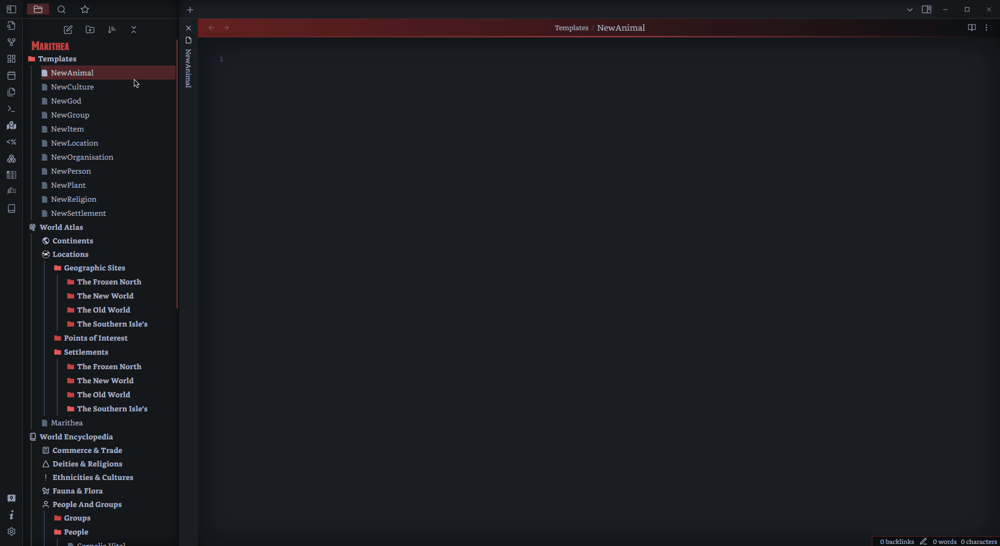

# Fanstasy Content Generator

This is a plugin for Obsidian (<https://obsidian.md>) for the generation of fantasy content like inn, settlements and names for characters based on races.

## Credits and Resources

Would Like to acknowledge these libraries and resources that I used to help create this.

The Fantasy-names (<https://github.com/Snake4life/fantasy-names>) github as it helped with understanding how these generators work,
The Fantasy Name Generator package (<https://www.npmjs.com/package/fantasy-name-generator>)
The Fantasy Content Generator Package (<https://www.npmjs.com/package/fantasy-content-generator>)

## How to Use

1. Select the Book icon in the ribbon
2. Select the Generator you would like to use
3. Edit the Settings to your hearts content
4. Click generate and copy your generation to your Clipboard.

### Example

## Custom Sources

In the settings of the plugin you will Find settings and options to add your own words and phrases to the generators, not all are added as of yet and there is no current plans to add more unless I get overwhelming requests for a particular one. The current Generators that can be customised are:

- loot generator
- Inn and Tavern generator
- Settlement Generator
- Drink Generator
- Group Generator.
- Currency.
- Dungeon Generator.

## Inline Generator

If you found yourself needing a quick name for an Elf or really wanting a quick dungeon description then look no further then the Inline generator. You can activate this by using the Callout token (Default is set to '@', can be changed in settings)and scrolling through the list of generators possible.

### Example

## Configuration

Below is a table for all the settings in this plugin
| Setting | Options |
| ------- | ------- |
| Reset | Click the Reset Button to return to defaults |
| Call Out | Modify the call out used when using the inline Generator|
| Currency | Enable Currency use in generation, How often it occurs and add type of currency with rarity. |
| Settlements | Modify an Array of both Prefixed and Suffixes that can be used to generate settlements.|
| Inn & Taverns | Modify Arrays of Prefixes, Types, Nouns, Descriptions and Rumors that will generate for Inns and Taverns.|
| Drinks | Modify an array of both adjectives and nouns that will be used for the drinks generator |
| Loot | Modify an array of both adjectives and nouns that will be used for the loot generator |
| Group | adjust the Adjectives, Nouns, Plural Nouns, Group Types and Single Descriptors for the group generator|
| Dungeon | adjust the Adjectives, Nouns, Locations, Dungeon types and Random Descriptions used by the Dungeon Generator.|

## TO-DO

- ~~Add more settings to help build custom generation settings for vaults for certain generators; Generators included in this are the~~
  - ~~loot generator~~
  - ~~Inn and Tavern generator~~
  - ~~Settlement Generator~~
  - ~~Drink Generator~~
  - ~~Group Generator.~~
- ~~Randomization within a note.~~
- Possibly more Generation type.
- Better UI
