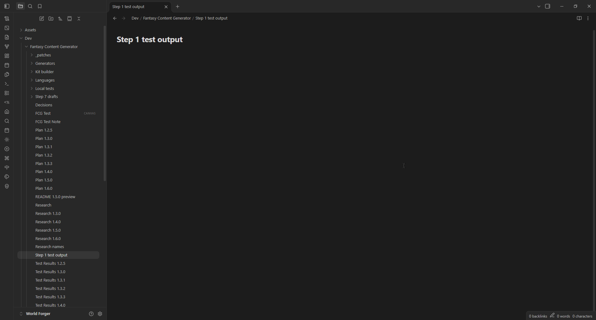
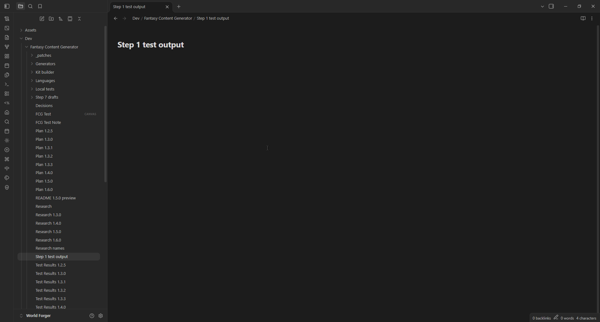

# TTRPG Content Generator

An [Obsidian](https://obsidian.md) plugin that fills your notes with names, inns, settlements, loot and more for any tabletop RPG or world, and lets you build your own generators from plain notes.

*Renamed from **Fantasy Content Generator** in 1.6.0. Nothing changes for you: settings, hotkeys and scripts keep working.*



## What it can do

- **Generator panel**: a side panel that stays open while you write. Pick a generator, generate a batch, and insert the ones you like straight into your note.
- **`@` in any note**: type `@` and a generator's name (for example `@Dwarvish`) to drop a result where you're writing.
- **Starter sets**: 30 ready-made name sets for fantasy peoples and human cultures, with names that can show what they mean: *Durak Nöndtrind (stone-helmet)*.
- **Your own generators**: a note with a few lists and a pattern becomes a generator. Add dice, tables, if/else, loops and calls to other generators as you need them.
- **Build your own world**: generators can pass values to each other, and scripts (for example Templater) can build whole villages as linked notes.



## Getting started

1. Install **TTRPG Content Generator** from **Settings › Community plugins** and turn it on.
2. Click the **scroll** icon in the left ribbon (or run **Open generator**) to open the panel.
3. Run **Add a starter set** from the command palette and pick a set (or **Add all starter sets**).
4. In any note, type `@Dwarvish` (or the set you added) and press Enter.

## Build your own generator

Run **New custom generator** for a starter note in your generator folder, or write one like this:

````markdown
---
fcg-generator: Tavern regulars
---
```pattern
{Name} the {Job}, who drinks {@Drinks}
```

## Name
- Name A
- Name B

## Job
- Job A
- Job B
````

`{Name}` picks from the list under `## Name`, and `{@Drinks}` calls the built-in Drinks generator. Replace the placeholder words with your own, then type `@TavernRegulars` in any note.

From there you can add dice (`{2d6}`), tables rolled with a die, `{#if $wealth > 60: … | …}`, loops, maths and calls to other generators (`{@InnsTaverns}`). **The full guide and every pattern rule are on the [wiki](https://github.com/Gregory-Jagermeister/TTRPG-Content-Generator/wiki).**

## Build your own world

Generators can hand values to each other. If you have a Tavern generator, `{@Tavern $wealth=$wealth $race=Dwarf}` runs it with that wealth and race. A generator that's called on its own can set its own fallback with `{$wealth ?= 1d100}`.

Run **Add the village example** to get a village, building and owner generator that work this way. With the Templater plugin, the [Build a village](https://github.com/Gregory-Jagermeister/TTRPG-Content-Generator/wiki/Build-a-village) script on the wiki turns them into a folder of linked notes: a village, its buildings and their owners.

## For script writers

Any plugin that runs JavaScript can use the generators:

```js
const fcg = app.plugins.plugins["fantasy-content-generator"].api;
fcg.generate("InnsTaverns");                          // text
fcg.generate("Tavern", { wealth: 70, race: "Dwarf" }); // with values passed in
fcg.generateData("ExampleVillage");                   // { text, values: { name, wealth, race } }
fcg.keys();                                           // every key
```

The id stays `fantasy-content-generator` after the rename. Details on the [wiki](https://github.com/Gregory-Jagermeister/TTRPG-Content-Generator/wiki/API-for-scripts).

## Settings

Every setting shows up in Obsidian's settings search.

| Where | What you can change |
|---|---|
| Main page | The inline trigger (`@`), the default amount, which groups show, reset to defaults |
| Custom generators page | The generator folder, new generator, starter sets, the village example, and the generators found with their problems |
| Currency page | Whether loot includes coins, how often, and your currencies |
| Settlements, Inns and taverns, Drinks, Loot, Dungeons pages | The word lists the built-in generators use: add with **+**, remove with **×**, a filter box on each list, and import or export as a `.json` file |

## Credits

The starter sets are built from:
- Languages designed by Gregory-Jagermeister and generated with Vulgarlang (<https://www.vulgarlang.com>).
- Human first names: US Social Security Administration baby-name data (<https://www.ssa.gov/oact/babynames/>, public domain). Surname parts collected by Gregory-Jagermeister.

## Changelog

**1.6.1**: settings rebuilt so they show up in Obsidian's settings search (needs Obsidian 1.13.1).

**1.6.0**: renamed to TTRPG Content Generator; the generator panel; patterns in notes; if/else, loops and maths; passing values between generators; the village example. Full list and older versions in [CHANGELOG.md](CHANGELOG.md).

## Contributing

Bug reports and pull requests are welcome. See [CONTRIBUTING.md](CONTRIBUTING.md).

## Development

```bash
npm install
npm run dev     # rebuilds main.js on every change (put the repo in a vault's .obsidian/plugins folder)
npm run build   # type check and production build of main.js
npm run lint    # Obsidian's own lint rules (eslint-plugin-obsidianmd)
npm test        # unit tests
```
